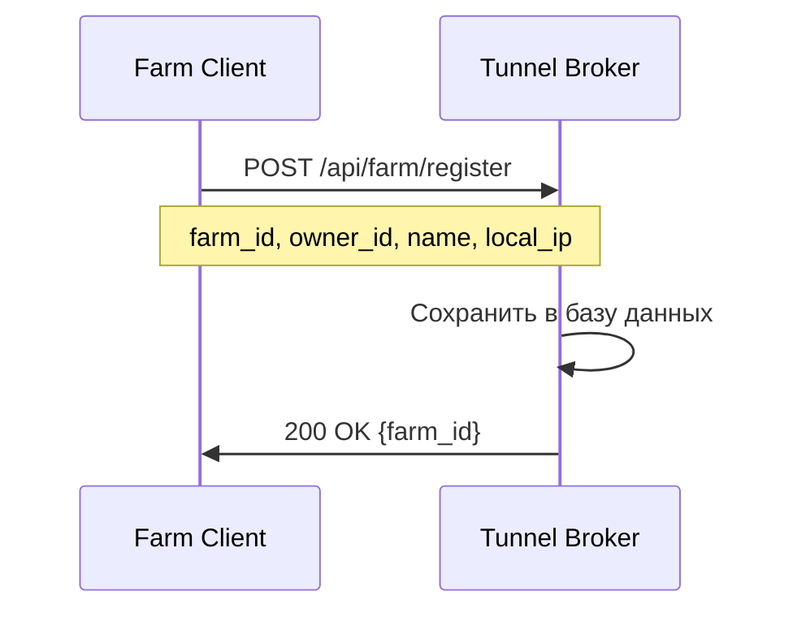
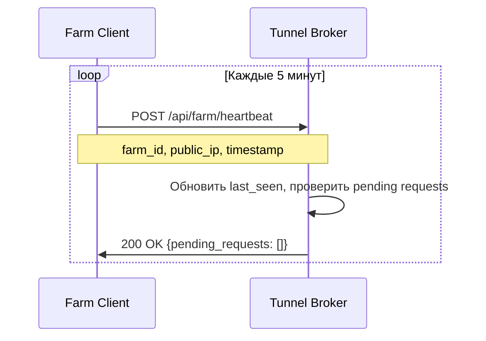
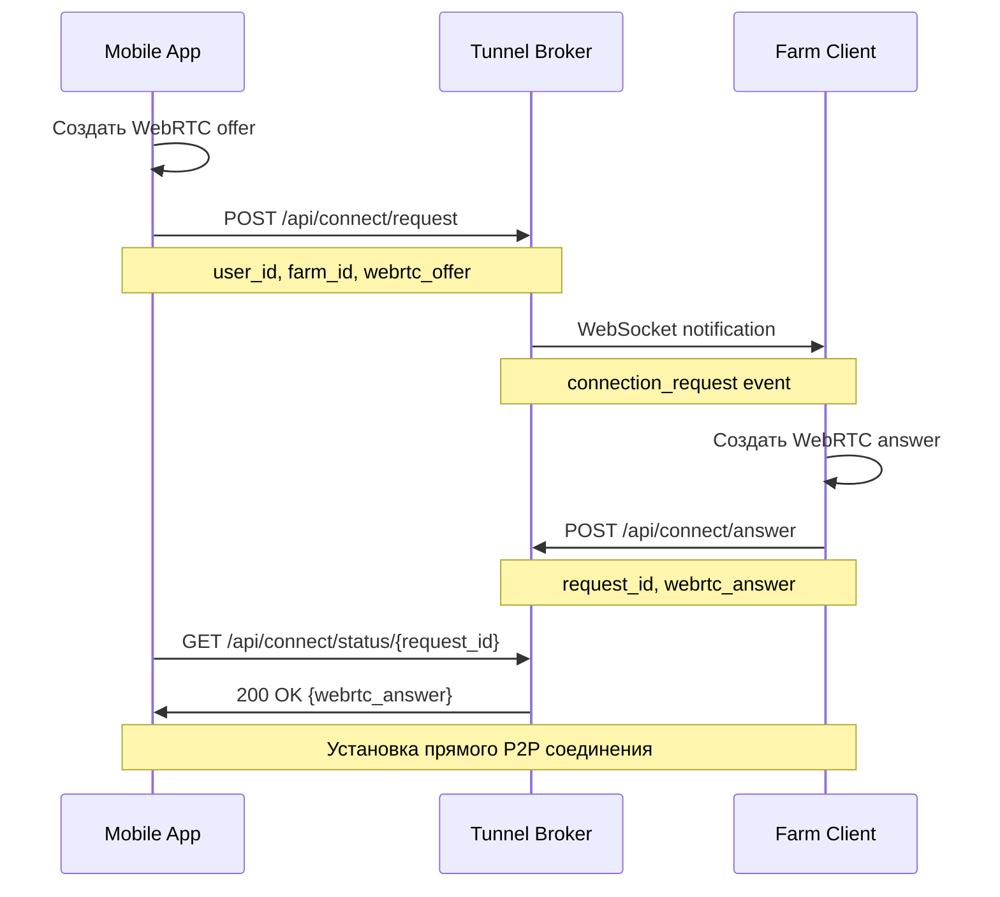

# 🌐 Tunnel System - P2P соединения для КУБ-1063

Система туннелирования по образцу IXON для прямого подключения мобильных приложений к фермам через WebRTC P2P соединения.

## 🏗️ Архитектура системы

```
📱 Mobile App ←--WebRTC P2P--→ 🏭 Farm Gateway
        ↓                           ↓
    📞 Request connection       📞 Register every 5min  
        ↓                           ↓
        🌐 Tunnel Broker Server (белый IP)
              ↓
        💾 SQLite Database
```

## 📦 Компоненты

### 1. **Tunnel Broker Server** (`tunnel_broker.py`)
- **Центральный сервер-коммутатор** с белым IP
- **База данных** пользователей и ферм  
- **WebSocket** для realtime уведомлений
- **REST API** для регистрации и координации соединений

### 2. **Farm Client** (`farm_client.py`)  
- **Клиент фермы** для регистрации в брокере
- **Heartbeat** каждые 5 минут с сообщением публичного IP
- **WebRTC server** для P2P соединений
- **API Proxy** для проксирования запросов к локальному Gateway

### 3. **Mobile App** (`mobile_app.py`)
- **Веб-приложение** для мобильных устройств
- **WebRTC client** для P2P соединений  
- **Аутентификация** через Tunnel Broker
- **Красивый интерфейс** для мониторинга ферм

## 🚀 Быстрый запуск

### Шаг 1: Запуск Tunnel Broker (сервер с белым IP)

```bash
# Установка зависимостей
pip install flask flask-cors websocket-server

# Запуск брокера
python tunnel_system/tunnel_broker.py --host 0.0.0.0 --port 8080
```

Сервер будет доступен на:
- HTTP API: `http://your-server-ip:8080`  
- WebSocket: `ws://your-server-ip:8081`

### Шаг 2: Регистрация пользователя

```bash
curl -X POST http://your-server-ip:8080/api/register \
  -H "Content-Type: application/json" \
  -d '{
    "username": "farmer1",
    "email": "farmer1@example.com", 
    "password": "password123"
  }'
```

### Шаг 3: Запуск Farm Client на ферме

```bash
# На компьютере фермы (серый IP)
python tunnel_system/farm_client.py \
  --broker http://your-server-ip:8080 \
  --farm-id my-farm-001 \
  --owner-id user_abc123 \
  --farm-name "Моя ферма КУБ-1063"
```

### Шаг 4: Запуск Mobile App

```bash
# Мобильное веб-приложение
python tunnel_system/mobile_app.py \
  --broker http://your-server-ip:8080 \
  --host 0.0.0.0 --port 5000
```

Приложение доступно на `http://localhost:5000`

## 🔐 Безопасность

### Аутентификация пользователей
- **SHA256 хеширование** паролей
- **Сессионные токены** для API доступа
- **Связь пользователь-ферма** через базу данных

### P2P соединения  
- **WebRTC шифрование** на уровне протокола
- **HMAC подписи** для координационных сообщений
- **Временные ограничения** запросов на соединение (5 минут)

### Изоляция ферм
- Каждая ферма доступна **только своему владельцу**
- **API Proxy** ограничивает доступ к локальным ресурсам
- **Автоматическое отключение** неактивных соединений

## 📊 База данных

### Таблица `users`
```sql
user_id TEXT PRIMARY KEY     -- Уникальный ID пользователя
username TEXT UNIQUE         -- Логин пользователя  
email TEXT UNIQUE           -- Email пользователя
password_hash TEXT          -- SHA256 хеш пароля
created_at REAL            -- Время регистрации
```

### Таблица `farms`
```sql
farm_id TEXT PRIMARY KEY    -- Уникальный ID фермы
owner_id TEXT              -- ID владельца фермы
farm_name TEXT             -- Название фермы
last_seen REAL             -- Последний heartbeat
local_ip TEXT              -- Локальный IP фермы  
public_ip TEXT             -- Публичный IP фермы
port INTEGER               -- Порт API Gateway
status TEXT                -- online/offline
api_key TEXT               -- API ключ фермы
capabilities TEXT          -- JSON массив возможностей
```

### Таблица `connection_requests`  
```sql
request_id TEXT PRIMARY KEY -- ID запроса на соединение
user_id TEXT               -- ID пользователя
farm_id TEXT               -- ID фермы
app_offer TEXT             -- WebRTC offer от приложения
farm_answer TEXT           -- WebRTC answer от фермы
status TEXT                -- pending/answered/expired
created_at REAL            -- Время создания
expires_at REAL            -- Время истечения
```

## 🌐 API Reference

### Tunnel Broker API

#### Пользователи
- `POST /api/register` - Регистрация пользователя
- `POST /api/login` - Авторизация пользователя  
- `GET /api/farms/{user_id}` - Список ферм пользователя

#### Фермы  
- `POST /api/farm/register` - Регистрация фермы
- `POST /api/farm/heartbeat` - Heartbeat от фермы
- `GET /api/farm/{farm_id}/status` - Статус фермы

#### P2P соединения
- `POST /api/connect/request` - Запрос на соединение  
- `POST /api/connect/answer` - Ответ фермы на соединение
- `GET /api/connect/status/{request_id}` - Статус запроса

### Farm API (через P2P туннель)
- `GET /api/data/current` - Текущие данные КУБ-1063
- `GET /api/data/history?hours=N` - Исторические данные
- `GET /api/data/statistics` - Статистика системы

## 🔄 Процесс соединения

### 1. Регистрация фермы


### 2. Периодический heartbeat  


### 3. P2P соединение


## 🛠️ Настройка production

### Tunnel Broker (VPS с белым IP)
```bash
# Systemd service
sudo nano /etc/systemd/system/tunnel-broker.service

[Unit]
Description=Tunnel Broker Server
After=network.target

[Service]
Type=simple
User=tunnel
WorkingDirectory=/opt/tunnel-system
ExecStart=/usr/bin/python3 tunnel_broker.py --host 0.0.0.0 --port 8080
Restart=always

[Install]
WantedBy=multi-user.target

# Запуск
sudo systemctl enable tunnel-broker
sudo systemctl start tunnel-broker
```

### Farm Client (автозапуск на ферме)
```bash
# Crontab для автозапуска
@reboot cd /path/to/CUBE_RS && python tunnel_system/farm_client.py --broker http://your-server-ip:8080 --farm-id $HOSTNAME --owner-id $USER_ID --farm-name "Ферма $HOSTNAME" >> /var/log/farm-client.log 2>&1
```

### Nginx (реверс-прокси)
```nginx
server {
    listen 80;
    server_name your-domain.com;
    
    location / {
        proxy_pass http://localhost:8080;
        proxy_set_header Host $host;
        proxy_set_header X-Real-IP $remote_addr;
    }
    
    location /ws {
        proxy_pass http://localhost:8081;
        proxy_http_version 1.1;
        proxy_set_header Upgrade $http_upgrade;
        proxy_set_header Connection "upgrade";
    }
}
```

## 🐛 Отладка

### Проверка Tunnel Broker
```bash
curl http://your-server-ip:8080/health
```

### Логи Farm Client  
```bash
# Проверка подключения к брокеру
curl -X POST http://your-server-ip:8080/api/farm/heartbeat \
  -H "Content-Type: application/json" \
  -d '{"farm_id": "test-farm"}'
```

### Тест P2P соединения
```bash
# В браузере dev tools на странице мобильного приложения
console.log("Активные WebRTC соединения:", pc.connectionState);
```

## ✨ Преимущества системы

1. **🚀 Прямые P2P соединения** - минимальная задержка
2. **🔒 Безопасность** - WebRTC шифрование + аутентификация  
3. **🌍 Доступ из любой точки** - работает через NAT и Firewall
4. **📱 Мобильная оптимизация** - адаптивный интерфейс
5. **⚡ Realtime уведомления** - WebSocket для мгновенной связи
6. **🔧 Простая настройка** - минимум конфигурации
7. **💾 Локальное хранение** - SQLite без внешних зависимостей

Система готова к использованию! 🎉