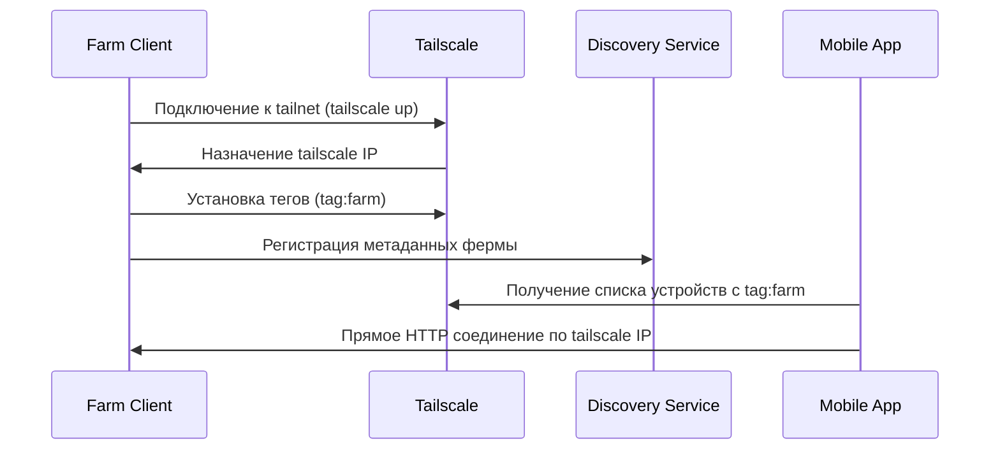

# 🌐 Tailscale-based Tunnel System Architecture

## 🎯 Цель
Создать полностью независимую систему туннелирования на базе Tailscale mesh-сети, заменив WebRTC + центральный broker на прямые соединения через Tailscale.

## 🏗️ Архитектура

```
📱 Mobile App ←---Tailscale Mesh---→ 🏭 Farm Gateway
        ↑                               ↑
        └──────Tailscale API────────────┘
                    ↓
            🎛️ Tailnet Management
              (автоматическое обнаружение)
```

### Компоненты системы:

#### 1. **Tailscale Mesh Network**
- Каждое устройство (ферма, мобильное приложение) подключено к единой tailnet
- Прямые зашифрованные соединения между узлами
- Автоматический NAT traversal и обход firewall

#### 2. **Farm Discovery Service** 
- Заменяет центральный broker
- Использует Tailscale API для обнаружения ферм в сети
- Автоматическая регистрация ферм при подключении к tailnet

#### 3. **Tailscale-aware Farm Client**
- Регистрируется в tailnet при запуске
- Предоставляет API через локальный IP в tailnet
- Отправляет heartbeat через Tailscale API

#### 4. **Mobile App с Tailscale интеграцией**
- Обнаруживает фермы через Tailscale API
- Прямые HTTP/WebSocket соединения к фермам
- Никаких WebRTC координаций

## 🔧 Технические детали

### Tailnet Setup
```yaml
tailnet_name: "kub1063-farms"
auth_method: "api_key"  # для автоматизации
acl_policy: |
  # Фермы могут общаться только с мобильными приложениями
  {
    "farms": ["tag:farm"],
    "mobile": ["tag:mobile"],
    "rules": [
      {"action": "accept", "src": ["mobile"], "dst": ["farms:*"]},
      {"action": "accept", "src": ["farms"], "dst": ["mobile:*"]}
    ]
  }
```

### Farm Registration Flow


### API Structure
```python
# Farm Discovery API (заменяет tunnel_broker)
GET /api/farms                    # Список всех ферм в tailnet
GET /api/farms/{tailscale_ip}     # Детали конкретной фермы
POST /api/farms/{tailscale_ip}    # Обновление метаданных фермы

# Farm API (прямое соединение)
GET http://{farm_tailscale_ip}/api/data/current
GET http://{farm_tailscale_ip}/api/data/history
POST http://{farm_tailscale_ip}/api/commands
```

## 🔐 Безопасность

### ACL Policies
```json
{
  "tagOwners": {
    "tag:farm": ["admin@kub1063.com"],
    "tag:mobile": ["admin@kub1063.com"]
  },
  "acls": [
    {
      "action": "accept",
      "src": ["tag:mobile"],
      "dst": ["tag:farm:8080", "tag:farm:8081"]
    },
    {
      "action": "accept", 
      "src": ["tag:farm"],
      "dst": ["tag:mobile:*"]
    }
  ]
}
```

### Аутентификация
- **Tailscale OAuth** для пользователей мобильного приложения
- **Pre-authorized keys** для автоматической регистрации ферм
- **API keys** для Discovery Service

## 🚀 Преимущества над WebRTC решением

| Критерий | WebRTC + Broker | Tailscale Mesh |
|----------|-----------------|----------------|
| **Зависимости** | Центральный broker с белым IP | Только Tailscale агент |
| **NAT traversal** | Требует STUN/TURN серверы | Встроенный |
| **Шифрование** | Ручная настройка | Автоматическое |
| **Firewall** | Сложная настройка портов | Автоматический обход |
| **Обнаружение устройств** | Ручная регистрация | Автоматическое через API |
| **Масштабирование** | Ограничено broker | Безлимитное mesh |
| **Отказоустойчивость** | SPOF (broker) | Децентрализованное |

## 📦 Компоненты для реализации

### 1. **TailscaleManager** 
```python
class TailscaleManager:
    async def get_devices(self, tag: str = None) -> List[Device]
    async def get_device_ip(self, hostname: str) -> str
    async def set_device_tags(self, device_id: str, tags: List[str])
    async def create_auth_key(self, ephemeral: bool = False) -> str
```

### 2. **FarmDiscoveryService**
```python  
class FarmDiscoveryService:
    async def register_farm(self, tailscale_ip: str, metadata: dict)
    async def get_farms(self, user_id: str = None) -> List[Farm]
    async def update_farm_status(self, tailscale_ip: str, status: str)
```

### 3. **TailscaleFarmClient**
```python
class TailscaleFarmClient:
    async def register_in_tailnet(self, farm_metadata: dict)
    async def start_api_server(self, port: int = 8080)
    async def heartbeat_to_discovery(self)
```

### 4. **TailscaleMobileApp**
```python
class TailscaleMobileApp:
    async def discover_farms(self) -> List[Farm]
    async def connect_to_farm(self, farm_ip: str) -> bool
    async def send_api_request(self, farm_ip: str, endpoint: str)
```

## 🛠️ План реализации

### Phase 1: Tailscale Integration Layer
- [ ] TailscaleManager class
- [ ] Базовое обнаружение устройств в tailnet
- [ ] Тестирование подключения

### Phase 2: Discovery Service
- [ ] FarmDiscoveryService заменяющий tunnel_broker
- [ ] Метаданные ферм (название, возможности, статус)
- [ ] RESTful API для управления

### Phase 3: Farm Client Adaptation  
- [ ] Адаптация существующего farm_client.py
- [ ] Автоматическая регистрация в tailnet
- [ ] Direct HTTP API через tailscale IP

### Phase 4: Mobile App Integration
- [ ] Интеграция с Tailscale OAuth
- [ ] Замена WebRTC на прямые HTTP соединения
- [ ] Адаптивный UI для работы с mesh

### Phase 5: Production Deployment
- [ ] ACL policies для безопасности
- [ ] Мониторинг и логирование
- [ ] Автоматическая установка tailscale агентов

## 📋 Requirements

```
tailscale>=1.0.0           # Python API client
aiohttp>=3.8.0            # Async HTTP client
flask>=2.0.0              # Web framework
pyyaml>=6.0               # Configuration
cryptography>=3.0.0      # Additional security
```

## 🎯 Результат

**Полностью независимая система туннелирования:**
- ✅ Никаких внешних сервисов (ngrok, STUN, TURN)
- ✅ Автоматическое обнаружение ферм
- ✅ Прямые зашифрованные соединения
- ✅ Простое развертывание (один агент)
- ✅ Enterprise-grade безопасность
- ✅ Масштабируемость без ограничений

---

**Next Steps:** Начинаем с реализации TailscaleManager для тестирования базовой интеграции.