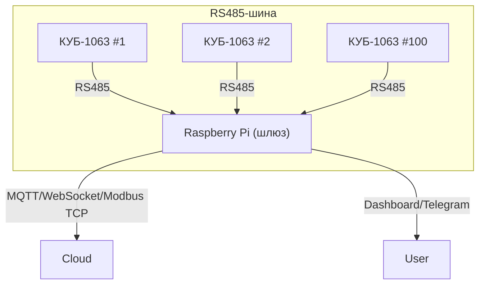

Это отличный и реалистичный вариант! Вот что важно знать и как это можно реализовать:

---

## 1. **Архитектура: 1 шлюз (Raspberry Pi) — много контроллеров (до 100)**

- **Raspberry Pi** (или аналогичный одноплатный компьютер) выступает как центральный программный шлюз.
- К нему по RS485-шине (или нескольким шинам) подключаются до 100 контроллеров КУБ-1063.
- Все сервисы (Modbus TCP, MQTT, WebSocket, Telegram-бот, Dashboard) работают на одном устройстве.

---

## 2. **Технические детали**

### **RS485 и Modbus RTU**
- Modbus RTU поддерживает до 247 устройств на одной шине, но на практике — до 32 без повторителей.
- Каждый контроллер должен иметь уникальный slave ID (адрес).
- Raspberry Pi опрашивает контроллеры по очереди, собирает данные и сохраняет их в SQLite.

### **Масштабируемость**
- **Raspberry Pi 3/4** легко справится с опросом 100 устройств, если опрос не слишком частый (например, раз в 10–60 секунд).
- Для высокой частоты опроса или большого количества данных — используйте Raspberry Pi 4 (2–4 ГБ RAM).

### **Программная реализация**
- В коде шлюза реализуется цикл опроса: перебираем все slave ID, читаем нужные регистры, сохраняем в базу.
- Все сервисы (MQTT, WebSocket, Dashboard, Telegram-бот) работают с этой базой и не нагружают Modbus-шину.

### **Физическое подключение**
- Все контроллеры подключаются к одной RS485-шине (A/B), которая подключена к Pi через USB-RS485 адаптер.
- Для надежности — использовать качественный кабель, терминаторы на концах шины.

---

## 3. **Преимущества такого подхода**

- **Централизованный сбор данных** — все данные в одной базе, легко интегрировать с облаком, SCADA, мобильными сервисами.
- **Минимальная нагрузка на контроллеры** — каждый опрашивается только одним шлюзом.
- **Гибкость** — можно добавить резервный шлюз, масштабировать систему, интегрировать новые сервисы.

---

## 4. **Возможные сложности**

- **Ограничения длины и качества RS485-шины** — для длинных линий (>500 м) или большого числа устройств нужны повторители.
- **Время опроса** — если опрашивать 100 устройств по 1 секунде на устройство, полный цикл займет ~100 секунд.
- **Обработка ошибок** — важно реализовать таймауты и повторные попытки для неотвечающих устройств.

---

## 5. **Пример архитектуры**



---

## 6. **Рекомендации**

- Используйте **Raspberry Pi 4** (или Compute Module) для максимальной производительности.
- Для надежности — используйте внешний SSD для базы данных.
- Для резервирования — можно добавить второй Pi в режиме «горячего резерва».
- Для облачного доступа — используйте проброс портов или VPN.

---

## 7. **Пример кода опроса**

```python
for slave_id in range(1, 101):
    try:
        data = read_from_modbus(slave_id)
        save_to_db(slave_id, data)
    except Exception as e:
        log_error(slave_id, e)
    time.sleep(0.1)  # чтобы не перегружать шину
```

---

## **Вывод**

- **Да, это рабочая и масштабируемая архитектура.**
- Один Raspberry Pi может обслуживать до 100 контроллеров КУБ-1063 по RS485.
- Все сервисы и облачные интеграции можно реализовать на одном устройстве.

---

**Если нужно — помогу подготовить пример кода, схему подключения или рекомендации по железу!**