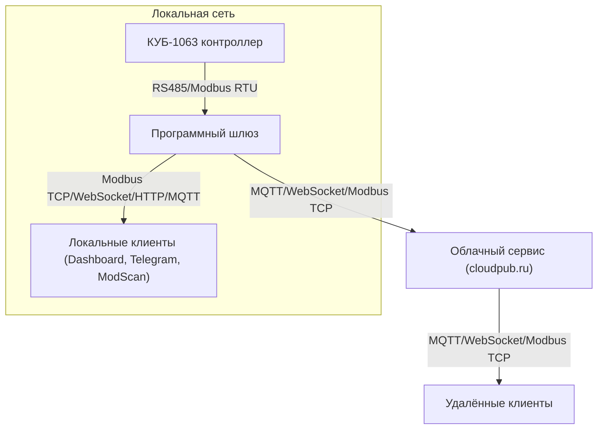

# Описание стенда и схемы связи

## 1. Общая архитектура

Стенд построен на базе контроллера КУБ-1063, к которому подключены различные датчики и исполнительные устройства. Для мониторинга и управления используется программный шлюз, который обеспечивает сбор данных и их передачу по различным каналам.

## 2. Схема связи

### Варианты подключения:

- **Прямое соединение**: 
  - Компьютер/сервер подключается к контроллеру КУБ-1063 по интерфейсу RS485 (Modbus RTU) через USB-RS485 преобразователь.
  - Программный шлюз (gateway) опрашивает контроллер и предоставляет данные локально (например, через Modbus TCP, WebSocket, HTTP API, MQTT).

- **Через шлюз**:
  - Программный шлюз работает на отдельном сервере или одноплатном компьютере, подключённом к КУБ-1063 по RS485.
  - Данные доступны локально и/или транслируются во внешние системы.

- **Через облако**:
  - Локальный шлюз публикует данные через сервис cloudpub.ru.
  - Порт шлюза (Modbus TCP/WebSocket) может быть проброшен во внешний мир через облачный сервис (cloudpub.ru, ngrok и др.), что позволяет удалённым клиентам получать данные напрямую.

### Схема (Mermaid):

## 3. Программный шлюз

- Получает данные с КУБ-1063 по Modbus RTU (RS485).
- Обеспечивает:
  - Локальный Modbus TCP сервер (порт проброшен через облако)
  - WebSocket сервер для веб-клиентов
  - HTTP API (опционально)
  - Публикацию данных в MQTT-брокер
  - Хранение данных в SQLite для локального доступа и истории

## 4. Перечень передаваемых параметров

Передаются все основные параметры, поддерживаемые КУБ-1063 (см. документацию на регистры):

- Версия ПО
- Температура (текущая, целевая, активации вентиляции)
- Влажность
- Давление
- CO2
- NH3
- Активные аварии и предупреждения
- Состояние цифровых выходов
- Уровень вентиляции (фактический и целевой)
- Схема вентиляции
- Счетчик дней
- Управление ГРВ, демпфером, освещением и др.

**Формат значений:**
- Температура, влажность, давление, NH3 — в десятых долях (например, 255 → 25.5)
- CO2 — в ppm (целое число)
- Уровень вентиляции — в десятых долях процента (например, 191 → 19.1%)
- Аварии/предупреждения — битовые поля

## 5. Протокол обмена

- **Modbus RTU** (RS485) — для связи шлюза с контроллером
- **Modbus TCP** — для локальных и удалённых клиентов (порт проброшен через облако)
- **WebSocket** — для веб-клиентов (локально и через облако)
- **MQTT** — для публикации данных в облако и интеграции с IoT/SCADA
- **HTTP API** (опционально) — для интеграции с внешними системами

## 6. Примечания
- Все обращения к контроллеру проходят через программный шлюз, что исключает конфликт одновременного доступа.
- Для удалённого доступа рекомендуется использовать проброс портов через облачный сервис (cloudpub.ru).
- Подробный список регистров и их описание — в файле Cube-1063_modbus registers 

## 7. Telegram-бот

- **Назначение:**
  - Telegram-бот предназначен для удалённого мониторинга и получения уведомлений о состоянии контроллера КУБ-1063 через мобильное приложение Telegram.

- **Функции:**
  - Отображение текущих параметров (температура, влажность, CO2, аварии, уровень вентиляции и др.)
  - Получение статистики и истории
  - Получение уведомлений о тревогах и событиях
  - Быстрый доступ к основным данным по команде или нажатию кнопки
  - Интерактивное меню с постоянными кнопками

- **Принцип работы:**
  - Бот получает данные через программный шлюз (читает из локальной базы данных SQLite, которую обновляет шлюз)
  - Все команды и запросы пользователя обрабатываются асинхронно, без прямого обращения к контроллеру (нет конфликтов доступа)
  - Может работать как локально (в одной сети со шлюзом), так и удалённо (если шлюз доступен через интернет)

- **Протокол:**
  - Использует Telegram Bot API для обмена сообщениями
  - Для получения данных использует локальный API шлюза или прямое чтение из базы данных

- **Преимущества:**
  - Удобный мобильный интерфейс
  - Оперативные уведомления о событиях
  - Не требует прямого доступа к контроллеру или сложной настройки VPN 